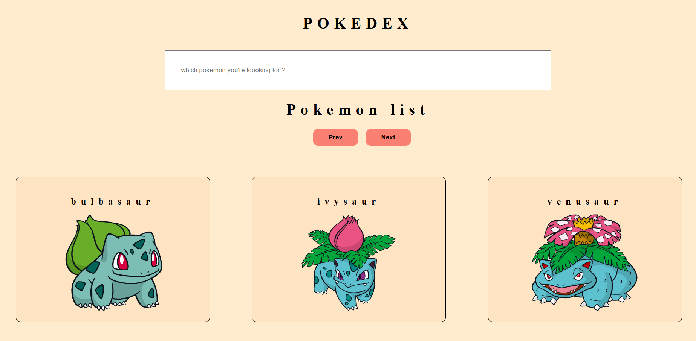
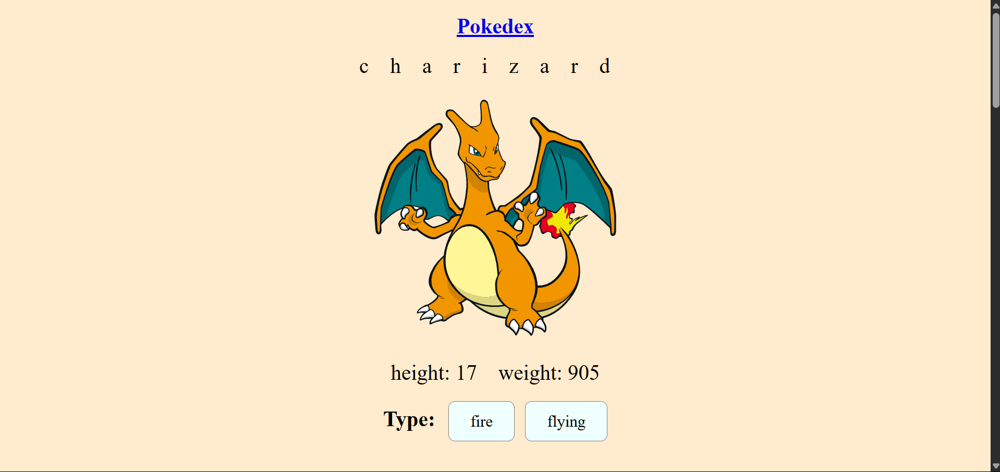
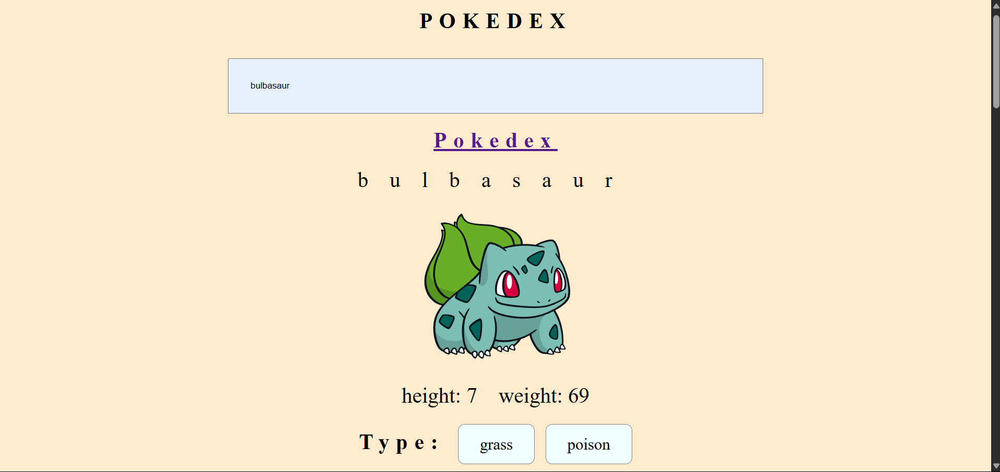
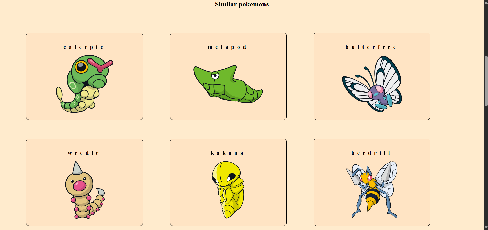

# PokeDex

PokeDex is a React-based web application that allows users to browse and search for Pokémon. It provides detailed information about each Pokémon, including their type, abilities, and stats.

## Features

- **Search Functionality**: Quickly search for Pokémon by name or ID.
- **Detailed Information**: View stats, abilities, and type for each Pokémon.
- **Responsive Design**: Fully responsive and works seamlessly on all devices.
- **Pagination**: Browse through Pokémon in a paginated view.
- **Favorites**: Mark Pokémon as favorites for quick access.

## Screenshots

### Home Page


### Pokémon Details


### Search Result


### Similar Result


## Installation and Setup

Follow these steps to run the project locally:

1. **Clone the Repository**:
    ```bash
    git clone https://github.com/amanhaidry/PokeDex.git
    cd PokeDex
    ```

2. **Install Dependencies**:
    Make sure you have Node.js installed, then run:
    ```bash
    npm install
    ```

3. **Start the Development Server**:
    ```bash
    npm run dev
    ```

4. **Open in Browser**:
    Navigate to `http://localhost:5173` in your browser.

## Deployed Link

The project is deployed on GitHub Pages and can be accessed here:  
[https://amanhaidry.github.io/PokeDex/](https://amanhaidry.github.io/PokeDex/)

### Routing Explanation

- **HashRouter**:  
  The project uses `HashRouter` because GitHub Pages does not support client-side routing with `BrowserRouter`. The `HashRouter` ensures that routes work correctly by appending a `#` to the URL (e.g., `https://amanhaidry.github.io/PokeDex/#/pokemon/1`).

- **Using BrowserRouter**:  
  If you want to use `BrowserRouter` instead of `HashRouter`, follow these steps:
  1. Replace `HashRouter` with `BrowserRouter` in `src/main.jsx`:
     ```jsx
     import { BrowserRouter } from 'react-router-dom';

     ReactDOM.createRoot(document.getElementById('root')).render(
         <BrowserRouter>
             <App />
         </BrowserRouter>
     );
     ```
  2. Add a `_redirects` file in the `public` directory with the following content:
     ```plaintext
     /*    /index.html   200
     ```
  3. Rebuild and redeploy the project:
     ```bash
     npm run build
     npm run deploy
     ```

  Note: Using `BrowserRouter` requires proper server configuration to handle route fallback, which is why `HashRouter` is the default for GitHub Pages.

## Technologies Used

- React.js
- CSS Modules
- Axios (for API calls)
- PokéAPI (data source)

---
Happy Coding.....
